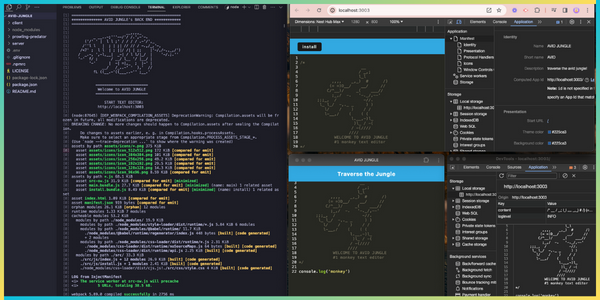

<p align="center">

</p>

[](https://opensource.org/licenses/MIT) 
[](https://nodejs.org/en)
[](https://expressjs.com/)
[](https://webpack.js.org/)
[](https://www.npmjs.com/package/Babel)
[](https://canva.com/)


### 

  - [OVERVIEW](#overview)
    - [*user story*](#user-story)
    - [*acceptance criteria*](#acceptance-criteria)
    - [*predator list*](#predator-list)
  - [INSTALLATION](#installation)
  - [USAGE](#usage)
    - [*screenshot*](#screenshot)
    - [*demo*](#demo)
  - [SOURCES](#sources)
  - [LICENSE](#license)
  - [LINKS](#links)
  - [CONNECT](#connect)

### 

`AVID JUNGLE` is a single-page text editor app (meeting [PWA](https://developer.mozilla.org/en-US/docs/Web/Progressive_web_apps) criteria) that runs in the browser, and will function offline. The app uses [Express.js](https://www.npmjs.com/package/express) for **routing**, [webpack](https://webpack.js.org/) to **budle** JavaScript files for usage in the browser, and [idb](https://www.npmjs.com/package/idb) for **storing & retrieving data**.

>The [.npmrc](https://docs.npmjs.com/cli/v10/configuring-npm/npmrc) file will set config values specific to this project, and ensures the app will deploy properly to [Heroku](https://www.heroku.com).


<!-- ###  -->
<!-- <p align="center">
  
</p> -->

<!-- ###  -->
<!-- <p align="center">
  
</p> -->

<!-- ###  -->
<!-- <p align="center">
  
</p> -->

#

### 

The application is invoked using the following commands:

##### *Clone the repository in your local development enviornment*

```
git clone https://github.com/christiecamp/avid-jungle.git
```

##### *Navigate to the CLI and input:*

```javascript
npm i
```

```javascript
npm run start:dev
```
#

### 

**INSTRUCTIONS:**

1. Open the Integrated Terminal and follow the [installation](#installation) guidelines.

2. Interact with `AVID JUNGLE's` text editor through your local enviorment, or open the [application](https://avid-jungle-65cf1ebd9bdd.herokuapp.com/) deployed on [Heroku](https://heroku.com/home).

3. Inspect the following through your local browser, or the PWA:
    * local storage
    * manifest
    * service worker
      ##### view [demo videos](#demo) for further help

<!-- ### 
             
##### *screenshot demonstrates `AVID JUNGLE's` back end, along with the downloadable `PWA`*


##### manifest
<p align="center">

</p> 

##### service worker


##### idb storage


###  -->


#

### 

Here's a list of technologies used:

1. [Node.js](https://nodejs.org/en) - an open-source, cross-platform JavaScript runtime environment.

2. [Express.js](<(https://expressjs.com)>) - a minimal and flexible Node.js web application framework that provides a robust set of features for web and mobile applications.

3. [Webpack](https://webpack.js.org/) - a JavaScript module bundler that is commonly used with [React](https://react.dev/) to bundle and manage dependencies, with help from:
    * [webpack-cli](https://www.npmjs.com/package/webpack-cli)
    * [webpack-dev-server](https://webpack.js.org/configuration/dev-server/)
    * [webpack-pwa-manifest](https://www.npmjs.com/package/webpack-pwa-manifest)
    * [workbox-webpack-plugin](https://www.npmjs.com/package/workbox-webpack-plugin)
    * [html-webpack-plugin](https://www.npmjs.com/package/html-webpack-plugin)

4. [Babel](https://www.npmjs.com/package/@babel/core) - tool to help write code in the latest version of JavaScript, with the help from:
    * [babel/plugin-proposal-object-rest-spread]()
    * [babel/plugin-transform-runtime]()
    * [babel/preset-env]()
    * [babel-loader]()

5. [Concurrently](https://www.npmjs.com/package/concurrently) - a Node.js tool that runs multiple commands concurrently.

6. [if-env](https://www.npmjs.com/package/if-env) - a Node.js tool that simplifies development to run `npm start` in all enviorments & run correct scripts.

7. [style-loader](https://www.npmjs.com/package/style-loader) - a Node.js tool that injects CSS into the [DOM](https://developer.mozilla.org/en-US/docs/Web/API/Document_Object_Model).

8. [http-server](https://www.npmjs.com/package/http-server) - simple command-line static HTTP server.

0. [idb](https://www.npmjs.com/package/idb) - a tiny library that mirros the [IndexedDB API](https://developer.mozilla.org/en-US/docs/Web/API/IndexedDB_API).

10. [css-loader](https://www.npmjs.com/package/css-loader) - a Node.js tool that interprets `@import` and `url()` & resolves them.

11. [code-mirror-themes](https://www.npmjs.com/package/code-mirror-themes) - a theme generated that exports themes from [CodeMirror](https://codemirror.net/).

12. [Nodemon](https://www.npmjs.com/package/nodemon) - a Node.js tool that helps develop applications by automatically restarting the node application when file changes in the directory are detected.

13. [Heroku](https://heroku.com) - used to deploy, manage, and scale the application.

### 

##### [mit license](./LICENSE)


### 

##### [*github repo*](https://github.com/christiecamp/avid-jungle)

##### [*deployed app*](https://avid-jungle-65cf1ebd9bdd.herokuapp.com/)

### 

[](https://github.com/christiecamp/avid-jungle)

<a href="mailto:christiecamphoto@gmail.com">

</a>
